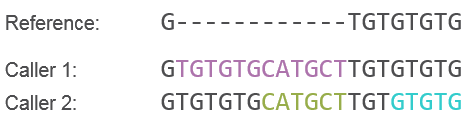

Haplotype Comparison Tools
==========================

Peter Krusche <pkrusche@illumina.com>

This is a set of programs based on [htslib](https://github.com/samtools/htslib)
to benchmark variant calls against gold standard truth datasets.

To compare a VCF against a gold standard dataset, use the following commmand line
to perform genotype-level haplotype comparison.

```bash
hap.py truth.vcf query.vcf -f confident.bed -o output_prefix -r reference.fa
```

We also have a script to perform comparisons only based on chromosome, position,
and allele identity. This comparison will not resolve haplotypes and only verify
that the same alleles were observed at the same positions (e.g. for comparison
of somatic callsets).

```bash
som.py truth.vcf query.vcf -f confident.bed -o output_prefix -r reference.fa
```

More information can be found below in the [usage section](#usage).

## Contents

* [Motivation](#motivation)
  * [Complex variant comparison](#complex-variant-comparison)
  * [Variant preprocessing](#variant-preprocessing)
  * [Variant counting](#variant-counting)
* [Usage](#usage)
  * [hap.py](#happy)
  * [som.py](#sompy)
* [Installation](#installation)
  * [Helper script](#helper-script)
  * [Docker](#docker)
  * [Compiling from source with CMake](#compiling-from-source-with-cmake)
* [System requirements](#system-requirements)
  * [Hardware](#hardware)
  * [Linux](#linux)
  * [OS X](#os-x)
  * [Windows](#windows)
  * [Other requirements](#other-requirements)

## Motivation
### Complex variant comparison

A major challenge when comparing VCF files for diploid samples is the handling
of complex variant representations. In a VCF file, we describe two haplotype
sequences by means of REF-ALT pairs and genotypes. These variant calls do not
uniquely represent the haplotype sequences: since alignments are always not unique
even when using a fixed set of gap and substitution scores,
different variant calling methods may produce different variant representations.
While some of these representational differences can be handled using
pre-processing of VCF files (e.g. variant trimming and left-shifting), others
cannot be fixed easily.

In addition to comparing VCF records individually, we produce a graph-based representation
of the VCF alleles, create all possible haplotype sequences, and compare
these by alignment / exact matching. Here is an example where this is needed:

*Variant representation 1 (shown in purple in the image below):*

```
CHROM POS   REF  ALT             GT
chrQ  10    G    GTGTGTGCATGCT   0/1
```

*Variant representation 2 (shown in green in the image below):*

```
CHROM POS   REF  ALT             GT
chrQ  16    G    GCATGCT         0/1
chrQ  19    T    TGTGTG          0/1
```



Both representations in this example are able to produce the same alt sequences,
but we are not able to match them up with standard VCF tools. In particular,
we can see from this example that the second representation actually may allow us
to create two different sets of alt sequences if they are part of unphased
heterozygous variant calls. When we don't know the phasing
of our variants, the insertions could have occurred on different haplotypes when using
representation 2.

With this tool, we can produce all haplotypes sequences by enumerating paths
through a reference graph. By finding the paths / alt alleles that are
consistent between two VCFs files we can produce accurate benchmarking
numbers for comparing a VCF to a gold standard truth set.
See [doc/spec.md](doc/spec.md) for more information.

An alternative method to compare  complex variant calls is implemented in
[RTG vcfeval](https://github.com/RealTimeGenomics/rtg-tools). It is possible
to use vcfeval with hap.py, and to use hap.py only for pre-processing,
stratification and counting.

The comparison method in vcfeval is more sophisticated than ours and can
resolve some corner cases more accurately.
For whole-genome comparisons, the difference between the two benchmarking
methods is small, but when focusing on difficult subsets of the genome or
when using variant calling methods that produce many complex variant calls,
these corner cases can become relevant. Moreover, when benchmarking against
gold-standard datasets that cover difficult regions of the genome (e.g.
[Platinum Genomes](http://www.illumina.com/platinumgenomes/)), the more complicated
subsets of the genome will be responsible for most of the difference between
methods.

### Variant preprocessing

Another component of hap.py is a variant pre-processing method which
deals with complex variant representations and MNPs. When different callers
may represent variants using a different number of VCF records, we should
attempt to count these in a consistent fashion between methods. One example
is the representation of MNVs as individual SNPs vs. as complex variants.

Consider the following case:

*Complex variant representation*:
```
chrQ  16    GGG    TTT         0/1
```

vs.

*Atomized representation*:
```
chrQ  16    G      T         0/1
chrQ  17    G      T         0/1
chrQ  18    G      T         0/1
```

If this variant is a false-positive, the first representation would naively
contribute a single FP record. A variant caller that outputs the second
representation would instead receive a penalty of three FPs for making
the same variant call. Overall, the difference between the two representations
might show significantly when looking at precision levels or false-positive
rates (since these are relative to the total number of query counts, which
use the same representations), but become important when we need to compare
absolute numbers of false-positives. For this case, hap.py can perform a re-alignment
of REF and ALT alleles on the query VCF, and splits the records into atomic
variant alleles to produce more granular counts using [pre.py](doc/normalisation.md).
Left-shifting and trimming are also supported.

### Variant counting

Hap.py includes a module to produce stratified variant counts. Variant types
are determined using a re-alignment of REF and ALT alleles. This is more reliable
than only using allele lengths. Consider the following complex deletion.

```
chr1    201586350       .       CTCTCTCTCT      CA
```

This complex variant call is equivalent to a deletion, followed by a SNP. Our
quantification code will recognize this variant as a deletion and a SNP, and will
count it in both categories (so a TP call for this variant will contribute a
SNP and an INDEL). This effectively deals with variant calling methods that
prefer to combine local haplotypes in the same variant records
(e.g. Freebayes / Platypus), which would otherwise fall into a hard-to-assess
"COMPLEX" variant call category that varies substantially between
different variant calling methods.

```
chr1    201586350       .       CTCTCTCTC       C
chr1    201586359       .       T               A
```

Another feature of the quantification module in hap.py is stratification into
variant sub-types and into genomic regions. For example, precision and recall
can be computed at the same time for all
[GA4GH stratification regions](https://github.com/ga4gh/benchmarking-tools/tree/master/resources/stratification-bed-files),
and for different INDEL lengths (\<5, 7-15, 16+). Hap.py also calculates
het-hom and Ti/Tv ratios for all subsets of benchmarked variants.
Note that all region matching in hap.py is based on reference coordinates
only. One case where this can lead to counterintuitive results is when considering
hompolymer insertions:

```
Reference:

>chrQ
CAAAAA

VCF:
chrQ    1   C   CA  0/1

BED for homopolymers:
1   6
```

In this example, the variant call given above would not be captured by the bed region for the
homopolymers because it is associated with the reference base just before. To account for this,
the bed intervals need to be expanded to include the padding base just before the regions.

Finally, we produce input data for ROC and precision/recall curves. An
[example](doc/microbench.md) is included.

## Usage

The main two tools are hap.py (diploid precision/recall evaluation) and som.py
(somatic precision/recall evaluation -- this ignores the GT and just checks for
presence of alleles). Other tools are qfy.py (which just executes the quantification
step of the analysis pipeline, this requires a
[GA4GH-intermediate](https://github.com/ga4gh/benchmarking-tools/) VCF file), and
[pre.py](doc/normalisation.md), which is hap.py's input cleaning and
variant normalisation step.

Here are some small example command lines. Advanced features like confident call
 / ambiguity / FP regions are also available, see the documentation for each
 tool for these.

Below, we assume that the code has been installed to the directory `${HAPPY}`.

### hap.py

See also [doc/happy.md](doc/happy.md).

```bash
$ ${HAPPY}/bin/hap.py  \
      example/happy/PG_NA12878_chr21.vcf.gz \
      example/happy/NA12878_chr21.vcf.gz \
      -f example/happy/PG_Conf_chr21.bed.gz \
      -o test
$ ls test.*
test.metrics.json  test.summary.csv
```

This example compares an example run of GATK 1.6 on NA12878 agains the Platinum
Genomes reference dataset (***Note: this is a fairly old version of GATK, so
don't rely on these particular numbers for competitive comparisons!***).

The summary CSV file contains all high-level metrics:

| Type          |  TRUTH.TOTAL|  QUERY.TOTAL | METRIC.Recall | METRIC.Precision | METRIC.Frac\_NA | TRUTH.TOTAL.TiTv\_ratio | QUERY.TOTAL.TiTv\_ratio | TRUTH.TOTAL.het\_hom\_ratio | QUERY.TOTAL.het\_hom\_ratio|
|---------------|-------------|--------------|---------------|------------------|-----------------|-------------------------|-------------------------|-----------------------------|----------------------------|
|INDEL          |         9124|         9905 |      0.869406 |         0.978441 |        0.194548 |                     NaN |                     NaN |                    1.463852 |                    1.209105|
|SNP            |        52520|        48078 |      0.894478 |         0.998258 |        0.021070 |                2.081002 |                2.082603 |                    1.595621 |                    1.487599|

These numbers tell us the SNP and indel recall of our query VCF against the
truth dataset. See [doc/happy.md](doc/happy.md) for more documentation and some
advice for their interpretation.

### som.py

Som.py is a simple comparison tool based on bcftools. It does not perform genotype or haplotype matching.

See [doc/sompy.md](doc/sompy.md) for more documentation.

```
${HAPPY}/bin/som.py example/sompy/PG_admix_truth_snvs.vcf.gz \
                    example/sompy/strelka_admix_snvs.vcf.gz \
                    -f example/sompy/FP_admix.bed.gz \
                    -o test
[...]
      type  total.truth  total.query     tp     fp   fn    unk  ambi    recall   recall2  precision        na  ambiguous
1     SNVs        16235        47530  15573  14698  662  17259     0  0.959224  0.959224   0.514453  0.363118          0
3  records        16235        47779  15573  14737  662  17469     0  0.959224  0.959224   0.513791  0.365621          0

ls test.*
test.stats.csv
```

The most relevant metrics are recall and precision. UNK calls are the calls that are outside the
coverage of the truthset.

## Installation

### Helper script

The simplest way to install hap.py is to use the helper script and your system Python install
(requires these packages: Cython, Scipy, numpy, pandas, pybedtools, pysam, bx-python).

This command installs everything into ~/hap.py-install:

```
python install.py ~/hap.py-install
```

To also download rtgtools during the installation process and deploy it with this version
of hap.py, you can add the `--with-rtgtools` flag. For this to work, you must have a working
installation of Java 1.8 and Apache Ant 1.9.x.

```
python install.py ~/hap.py-install --with-rtgtools
```

The installer has an option `--boost-root` that allows us to use a specific installation of boost
(see above for instructions):

```
python install.py ~/hap.py-install --boost-root $HOME/boost_1_55_0_install
```

To use a special version of Python, run the installer with it:

```
$HOME/my-virtualenv/bin/python install.py ~/hap.py-install
```

To create a virtualenv:

```
python install.py ~/workspace-is/hap.py-install --python=virtualenv --python-virtualenv-dir=$HOME/my-virtualenv/hc.ve
```

There are various workaround / testing switches:

* `--python-virtualenv-update`  updates an existing virtualenv
* `--python-virtualenv-force`  overwrites the virtualenv if it exists
* `--pip-fix-cert` works around outdated SSL certificates when using pip
* `--no-tests` disables the unit/integration tests after installation
* `--no-rebuild-external` don't rebuild the external dependencies (htslib, ...) unless necessary
* `--sge-mode` require switch `--force-interactive` to run hap.py
 interactively (useful to prevent running on a head node when installing on
 systems with SGE)

### Docker

Clone this repository and build a Docker image as follows.
```
$ sudo docker build .
$ sudo docker images
REPOSITORY     TAG            IMAGE ID            CREATED             VIRTUAL SIZE
<...>          latest         3d03a99b3d81        1 second ago        <...>
$ sudo docker run -ti --rm 3d03a99b3d81 bin/bash
$/ /opt/hap.py/bin/hap.py
```
A pre-built docker image can be found here: [https://hub.docker.com/r/pkrusche/hap.py](https://hub.docker.com/r/pkrusche/hap.py). It can
be obtained by running:
```bash
docker pull pkrusche/hap.py
```
If the current directory contains a clone of the hap.py repository, hap.py can be run in Docker as follows:
```bash
sudo docker run -it -v `pwd`:/data pkrusche/hap.py /opt/hap.py/bin/hap.py /data/example/PG_performance.vcf.gz /data/example/performance.vcf.gz -o /data/test
```
The `-v` argument mounts the current directory as `/data` in the Docker image. The output should also
appear in the current directory.

The default Docker image is based on Ubuntu. To use a Centos6 image as a base, use [Dockerfile.centos6](Dockerfile.centos6).

```
docker build -f Dockerfile.centos6 .
```

### Compiling from source with CMake

You will need these tools / libraries on your system to compile the code:

* CMake &gt; 2.8
* GCC/G++ 4.9.2+ for compiling
* Boost 1.55+
* Python 2, version 2.7.8 or greater
* Python packages: Pandas, Numpy, Scipy, pysam, bx-python
* Java 1.8 when using vcfeval.

Then to compile:

1.  Get a hap.py checkout:
    ```bash
    git clone https://github.com/sequencing/hap.py
    ```
2.  Make a build folder
    ```bash
    mkdir hap.py-build
    cd hap.py-build
    ```
3.  Run CMake
    ```bash
    cmake ../hap.py
    ```
4.  Build
    ```bash
    make
    ```

If this is successful, the bin subdirectory of your build folder will contain binaries and scripts:

```bash
$ python bin/hap.py --version
Hap.py v0.3.7
```

Note that hap.py will copy all Python source files to the build folder, so when making changes to
any Python component, `make` must be run to make sure the scripts in the build folder are
up-to-date.

The source for hap.py contains a script [configure.sh](configure.sh) which shows some basic additional
configuration flags, and an automated way to pre-package CMake setups. Here is a list of additional flags for CMake to change compile options help it find dependencies:

*  `-DCMAKE_BUILD_TYPE=Debug` -- set the build type, allowed values are `Debug` and `Release`
*  `-DCMAKE_C_COMPILER=/usr/bin/gcc` and `-DCMAKE_CXX_COMPILER=/usr/bin/g++` -- change the compiler path
*  `-DCMAKE_INSTALL_PREFIX=/usr/local` -- set an installation directory that will be used by make install.
*  `-DBOOST_ROOT=$HOME/boost_1_55_0_install` -- set the path to Boost. Run the following commands to compile and install boost:
```bash
cd ~
wget http://downloads.sourceforge.net/project/boost/boost/1.55.0/boost_1_55_0.tar.bz2
tar xjf boost_1_55_0.tar.bz2
cd boost_1_55_0
./bootstrap.sh --with-libraries=filesystem,chrono,thread,iostreams,system,regex,test,program_options
./b2 --prefix=$HOME/boost_1_55_0_install install
```
*  `-DUSE_SGE` -- enable the `--force-interactive` switch in hap.py.
*  `-DBUILD_VCFEVAL=ON` -- Download and build rtgtools / vcfeval. This is a comparison engine that can be used
   as an alternative to the built-in xcmp in hap.py. To successfully build and run vcfeval, you will need:
   - A Java JRE, newer than 1.8.x
   - ant > 1.9.2 (older versions of ant will not successfully build rtgtools)
   See [src/sh/illumina-setup.sh]() for an example. If running Java requires any special setup
   (or to configure any other environment variables), you can specify a wrapper script using
   `-DVCFEVAL_WRAPPER={absolute_path_to_wrapper_script}`. See [src/sh/rtg-wrapper.sh]() for an
   example.


## System requirements

### Hardware

Compiling and testing can be done on a standard desktop system with 8GB of RAM. Whole-genome
comparisons (e.g. comparing a gVCF file against the [Platinum Genomes truth dataset](http://www.illumina.com/platinumgenomes/))
can use up to 64GB of RAM (20GB typical, depending on the input VCF) and about 4-12 minutes
using 40 processor cores. Whole exome comparison (using an exome bed mask and the `-T` switch)
can be carried out on a desktop system.

### Linux

Hap.py is known to build and run on the following linux distributions (see also the [Dockerfile](Dockerfile)
for a list of required packages):

    Ubuntu 12.04,14.04,16.04
    CentOS 5,6,7

Hap.py must be compiled with g++ version 4.9.x or later, or with a recent version of Clang (testing is performed
with g++).

### OS X

Hap.py builds and passes basic tests on OS X 10.9+, but full WGS analyses are not tested for this platform.

### Windows

Hap.py is not tested on Windows. The main dependency that fails compilation is htslib. Given a build
of htslib and pysam, using hap.py on Windows should be possible.

### Other requirements

Hap.py requires a human genome reference sequence which contains at least
chromosomes 1-22,X,Y,M. The chromosomes should be named chr1-chr22, chrX, chrY,
chrM. there is a script  in [src/sh/make_hg19.sh](src/sh/make_hg19.sh) to create
such a sequence, but you can also  specify your own. In order for the
integration tests to run successfully, it is necessary  to point hap.py to the
reference sequence using

```bash
export HGREF=<path-to-hg19.fa>
```

Note that, while the test cases are based on hg19, other reference sequences are
usable as well  once the tool is installed.

Hap.py also requires a copy of the [Boost libraries](http://www.boost.org) to
work, with version >=  1.55. If compilation should fail using the included version
of boost, you can compile a subset of boost like this:

```bash
cd ~
wget http://downloads.sourceforge.net/project/boost/boost/1.55.0/boost_1_55_0.tar.bz2
tar xjf boost_1_55_0.tar.bz2
cd boost_1_55_0
./bootstrap.sh --with-libraries=filesystem,chrono,thread,iostreams,system,regex,test,program_options
./b2 --prefix=$HOME/boost_1_55_0_install install
```

You can point Cmake to your version of boost as follows:

```bash
export BOOST_ROOT=$HOME/boost_1_55_0_install
```

The complete list of dependencies / packages to install beforehand can be found
in the [Dockerfile](Dockerfile).
