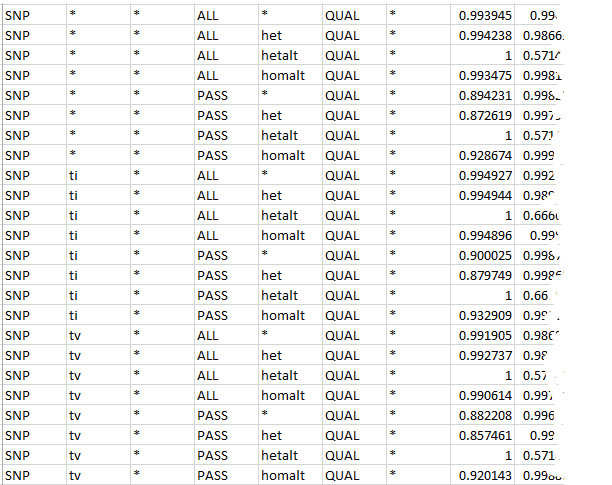
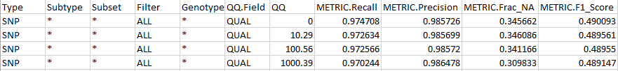

# Hap.py User's Manual

<!-- TOC depthFrom:1 depthTo:6 withLinks:1 updateOnSave:1 orderedList:0 -->

- [Hap.py User's Manual](#happy-users-manual)
- [Introduction](#introduction)
- [Getting started](#getting-started)
- [Full list of command line options](#full-list-of-command-line-options)
	- [Minimal options](#minimal-options)
	- [Running and debugging issues](#running-and-debugging-issues)
	- [Restricting to subsets of the genome](#restricting-to-subsets-of-the-genome)
	- [Additional input options](#additional-input-options)
	- [Working with genome VCFs](#working-with-genome-vcfs)
	- [Additional outputs](#additional-outputs)
	- [Comparison engines](#comparison-engines)
	- [Stratification via BED regions](#stratification-via-bed-regions)
	- [Internal variant normalisation and haplotype comparison](#internal-variant-normalisation-and-haplotype-comparison)
	- [ROC curves](#roc-curves)
	- [Input preprocessing using bcftools](#input-preprocessing-using-bcftools)
	- [Haplotype comparison parameters](#haplotype-comparison-parameters)
	- [Using RTG-Tools - VCFEval as the comparison engine](#using-rtg-tools-vcfeval-as-the-comparison-engine)
-  [Full list of output list of output columns](#full-list-of-output-columns)

<!-- /TOC -->

# Introduction

Hap.py is a tool to compare diploid genotypes at haplotype level. Rather than
comparing VCF records row by row, hap.py will generate and match alternate
sequences in a _superlocus_. A _superlocus_ is a small region of the
genome (sized between 1 and around 1000 bp) that contains one or more variants.

Matching haplotype sequences rather than VCF records is more accurate. It allows
 us to do the following things:

*  We can match up variant records that represent the same alt sequences in a
   different form (see [../example/GiaB](../example/GiaB)).
*  We can also more accurately merge variant call sets
   (see [ls_example.md](ls_example.md)).

The inputs to hap.py are two VCF files (a "truth" and a "query" file), and an
optional "confident call region" bed file (NOTE: bed files with
[track information](https://genome.ucsc.edu/goldenPath/help/customTrack.html)
are not supported, all input bed or bed.gz files must only contain bed records).

> Note: If you are running hap.py with _genome_ VCFs that include symbolic alleles
> please see the section [Working with genome VCFs](#working-with-genome-vcfs)

Hap.py will report counts of

*   ***true-positives (TP)*** : variants/genotypes that match in truth and query.
*   ***false-positives (FP)*** : variants that have mismatching genotypes or alt
    alleles, as well as query variant calls in regions a truth set would call
    confident hom-ref regions.
*   ***false-negatives (FN)*** : variants present in the truth set, but missed
    in the query.
*   ***non-assessed calls (UNK)*** : variants outside the truth set regions

From these counts, we are able to calculate

```
Recall = TP/(TP+FN)
Precision = TP/(TP+FP)
Frac_NA = UNK/total(query)
F1_Score = 2 * Precision * Recall / (Precision + Recall)
```

When comparing two VCFs, genotype and allele mismatches are counted both as
false-positives and as false-negatives. Truth sets like Platinum Genomes or
NIST/Genome in a Bottle also include "confident call regions", which show places
where the truth dataset does not expect variant calls, or selects a subset
of truth variants that are high-confidence.
Hap.py uses these regions to count truth or query variant calls outside these
regions as unknown (UNK), query variant calls inside these regions either as
TP or FP.

Truthset confident regions are passed to hap.py using the `-f` command line
option. Note that this is different from restricting comparison to a subset
of the genome using `-T` or `-R`: variants outside the confident regions
do not get removed from the input files, they will be used during comparison
but then counted as UNK during quantification.

Note that some special rules for variant capture by confident regions apply.
In particular, we trim variant alleles to determine their exact reference locations,
and we use these for computing confident region overlap. For more information,
see [Stratification via Bed Regions](#stratification-via-bed-regions).

Counts and statistics will be calculated for the following subsets of
variants:

| **Type** | **Description**                                                    |
|:--------:|:-------------------------------------------------------------------|
| `SNP`    | SNP or MNP variants. We count single nucleotides that have changed |
| `INDEL`  | Indels and complex variants                                        |

Hap.py (and qfy.py, which is the part of the hap.py that counts variants) also
computes counts for subtypes and observed genotypes in the above two categories.

| **Subtype**  | **Description**                        |
|:------------:|:---------------------------------------|
| `*`          | Aggregate numbers for all subtypes     |
| `ti` or `tv` | Transitions and transversions for SNPs |
| `I1_5`       | Insertions of length 1-5               |
| `I6_15`      | Insertions of length 6-15              |
| `I16_PLUS`   | Insertions of length 16 or more        |
| `D1_5`       | Deletions of length 1-5                |
| `D6_15`      | Deletions of length 6-15               |
| `D16_PLUS`   | Deletions of length 16 or more         |
| `C1_5`       | Complex variants of length 1-5         |
| `C6_15`      | Complex variants of length 6-15        |
| `C16_PLUS`   | Complex variants of length 16 or more  |

| **Genotype** | **Description**                                                        |
|:------------:|:-----------------------------------------------------------------------|
| `*`          | Aggregate numbers for all genotypes                                    |
| `het`        | only heterozygous variant calls (0/1 or similar genotypes)             |
| `homalt`     | only homozygous alternative variant calls (1/1 or similar genotypes)   |
| `hetalt`     | only heterozygous alternative variant calls (1/2 or similar genotypes) |

Note that currently the granularity of counting is on a per-VCF-record level. In
complex/high-variability regions, the classifications above might become inaccurate
due to nearby variants (e.g. an insertion with a close-by SNP would be more accurately
classified as "complex" if the SNP and the insertion occur on the same haplotype).
Future versions will address this by counting superloci rather than VCF records.

Hap.py also supports stratification regions for more detailed output stratification (one
example use case is computing precision / recall on exoms as well as on the whole genome,
or using the stratification regions from the GA4GH benchmarking repository at
[https://github.com/ga4gh/benchmarking-tools](https://github.com/ga4gh/benchmarking-tools).

# Getting started

Below, we assume that the code has been installed to the directory `${HAPPY}`.

```bash
$ ${HAPPY}/bin/hap.py  \
      example/happy/PG_NA12878_chr21.vcf.gz \
      example/happy/NA12878_chr21.vcf.gz \
      -f example/happy/PG_Conf_chr21.bed.gz \
      -o test
$ ls test.*
test.extended.csv  test.roc.all.csv              test.roc.Locations.INDEL.PASS.csv  test.roc.Locations.SNP.PASS.csv  test.vcf.gz
test.metrics.json  test.roc.Locations.INDEL.csv  test.roc.Locations.SNP.csv         test.summary.csv                 test.vcf.gz.tbi
```

This example compares an example run of GATK 1.6 on NA12878 against the Platinum
Genomes reference dataset (***Note: this is a fairly old version of GATK, so
don't rely on these particular numbers for competitive comparisons!***).

The summary CSV file contains all computed metrics:

| Type  | Filter | TRUTH.TOTAL | TRUTH.TP | TRUTH.FN | QUERY.TOTAL | QUERY.FP | QUERY.UNK | FP.gt | METRIC.Recall | METRIC.Precision | METRIC.Frac_NA | TRUTH.TOTAL.TiTv_ratio | QUERY.TOTAL.TiTv_ratio | TRUTH.TOTAL.het_hom_ratio | QUERY.TOTAL.het_hom_ratio |
|-------|--------|-------------|----------|----------|-------------|----------|-----------|-------|---------------|------------------|----------------|------------------------|------------------------|---------------------------|---------------------------|
| INDEL | ALL    | 9124        | 8100     | 1024     | 11731       | 228      | 3460      | 71    | 0.887769      | 0.972434         | 0.294945       | NaN                    | NaN                    | 1.463852                  | 1.423305
| INDEL | PASS   | 9124        | 7869     | 1255     | 9910        | 176      | 1922      | 48    | 0.862451      | 0.977967         | 0.193946       | NaN                    | NaN                    | 1.463852                  | 1.209239                  |
| SNP   | ALL    | 52520       | 52202    | 318      | 90092       | 476      | 37377     | 109   | 0.993945      | 0.990970         | 0.414876       | 2.081246               | 1.745874               | 1.595621                  | 3.132586                  |
| SNP   | PASS   | 52520       | 46965    | 5555     | 48083       | 83       | 1013      | 8     | 0.894231      | 0.998237         | 0.021068       | 2.081246               | 2.089405               | 1.595621                  | 1.487858                  |

Note that the e.g. Ti/Tv and het/hom ratios for different subsets of the genome
can differ (e.g. the expected Ti/Tv ratio for WGS and exome is normally different).

The extended table gives metrics in a more stratified format:

* it contains counts stratified over the different genotypes and variant subtypes
* it also contains Ti/Tv and het/hom ratios for each variant classification (TP/FN/...)
* if stratification regions were specified, it will contain a breakdown into
  these regions.



# Full list of command line options

## Minimal options

You can run hap.py with the -h switch to get help.

The first two positional arguments are used as the input VCF files. The output
file prefix is specified using `-o` (this should be something in the form
of directory/prefix):

```
$ ${HAPPY}/bin/hap.py truth.vcf.gz query.vcf.gz \
      -o output-prefix --force-interactive
```

## Running and debugging issues

```
  --force-interactive
```

Force running interactively (i.e. when JOB_ID is not in the environment)
This is only available if Hap.py is set up to run inside SGE.
Unless forced, it will not run interactively
(it detects this by looking for the environment variable SGE_JOB_ID).

The reason for this is that parallelism is implemented using the multiprocessing
module in Python, which spawns processes that can take a lot of memory and also
may be difficult to kill interactively.

*This feature must be enabled when installing / compiling hap.py.* See the
installation instructions in [../README.md](../README.md).

```
  --threads THREADS
```

The number of threads to use. This is detected automatically by default using
Python's multiprocessing module (we recommend around 1GB of RAM per thread).

```
  --logfile LOGFILE
```

Write logging information into file rather than to stderr.

```
  --scratch-prefix SCRATCH_PREFIX
  --keep-scratch
```

All temporary files go into a scratch folder, which normally defaults to a
subdirectory of `/tmp`. This can be customised (e.g. when fast local storage is
available).

## Restricting to subsets of the genome

```
  --location LOCATIONS, -l LOCATIONS
```

Add a location to the compare list (when not given, hap.py will use chr1-22,
chrX, chrY).

```
  --pass-only
```

Use to include only variants in the comparison that pass all filters.

```
  -R REGIONS_BEDFILE, --restrict-regions REGIONS_BEDFILE
```

Restrict analysis to given (sparse) regions (similar to using -R in bcftools).
Sparse regions should be used when there are not many regions to look at
(the corresponding calls are retrieved via tabix lookup, so this will be
slow for many regions). Also, the regions must not overlap (otherwise, hap.py
will fail).

```
  -T TARGETS_BEDFILE, --target-regions TARGETS_BEDFILE
```

Restrict analysis to given (dense) regions (similar to using -T in bcftools).
One example use for this is to restrict the analysis to exome-only data.

## Additional input options

```
  -f FP_BEDFILE, --false-positives FP_BEDFILE
```

False positive / confident call regions (.bed or .bed.gz).

```
  -r REF, --reference REF
```

Specify the reference FASTA file to use. Hap.py detects a default reference
sequence file at the following locations:

*  at `/opt/hap.py-data/hg19.fa` (see the Dockerfile)
*  at the location of the HGREF or the HG19 environment variable

To specify a default reference file location, you can run

```bash
export HGREF=path-to-your-reference.fa
```

before running hap.py.

## Working with genome VCFs

The presence of the <NON_REF> symbolic allele in genome VCFs can cause problems
for hap.py, especially if it is part of a genotype. As a workaround, we 
provide several options. Since variants genotyped as <NON_REF> cannot be
sensibly scored, the we provide the following option, which is safe to use
on both genome VCFs and standard VCFs:

```
  --filter-nonref       Remove any variants genotyped as <NON_REF>.
                        
```

If hap.py still crashes when processing a genome VCF, we provide separate
options to perform on-the-fly conversion of a genome VCF to a standard VCF
by removing all <NON_REF> alleles and non-variant blocks. Note that this 
also removes some fields from the INFO column. These options should only
be used on genome VCFs since attempting to convert a standard VCF will 
cause all biallelic variants to be filtered out (most of them).

```
  --convert-gvcf-truth Convert the truth genome VCF to a standard VCF.
  --convert-gvcf-query Convert the query genome VCF to a standard VCF.
                        
```

## Additional outputs

```
  -V, --write-vcf
```

Write an annotated VCF. This file follows the GA4GH specifications at
[https://github.com/ga4gh/benchmarking-tools/blob/master/doc/ref-impl/README.md](https://github.com/ga4gh/benchmarking-tools/blob/master/doc/ref-impl/README.md)

It shows the merged and normalised truth
and query calls, together with annotation that shows how they were counted.
There are two sample columns ("TRUTH" and "QUERY"), showing the genotypes
for each variant in truth and query, along with information on the decision
for truth and query calls (TP/FP/FN/N/UNK).
See the [GA4GH page above](https://github.com/ga4gh/benchmarking-tools/blob/master/doc/ref-impl/README.md)
for more details.

## Comparison engines

Hap.py can produce benchmarking results and ROCs using different comparison methods which implement the
[GA4GH intermediate format](https://github.com/ga4gh/benchmarking-tools/blob/master/doc/ref-impl/README.md).

These methods are:

* *xcmp* (hap.py's default comparison engine): this method will assume that both input
  samples are diploid / human samples. Matching is performed on a haplotype level: xcmp
  enumerates all possible haplotypes that may be described by truth and query within
  a small superlocus. If matching pairs of haplotype sequences are found, xcmp will
  convert all variants within the surrounding superlocus into TPs. Xcmp also recognizes
  direct genotype or allele matches / mismatches (i.e. the resulting FP.GT and FP.AL
  columns after running quantify will be meaningful). Global phasing information is used
  to restrict haplotype enumeration, but PS phasing is not supported.
* *Rtgtools vcfeval* (see below for more detailed instructions): this is a comparison
  that is simular to xcmp, but which uses an optimization method to determine TP/FP
  status on a per-variant level (rather than xcmp's per-superlocus level). This method
  does not use phasing information when it is present in the input VCF file, and
  input files must not contain symbolic records (hap.py's preprocess tool can mitigate
  this when). Vcfeval will not report 'local matches', i.e. FP.AL will be zero when using
  this method. Vcfeval support must be enabled at build/install time since it requires
  Java to be available.
* *scmp-distancebased*: this will match variants by location only. Any variant in the
  query that has a truth variant nearby (the distance can be set using the `--scmp-distance`
  parameter).
* *scmp-somatic*: this mode is intended to be used with Tumor/Normal VCF files. Variants
  in the query will be matched to truth variants if the same normalized alleles are found nearby.
  Genotypes are ignored, and multi-sample VCF files will be collapsed into a single column
  with a pre-specified genotype (this can be customized using the `--set-gt` command
  line option, which also works with all the other comparison engines).

There are a quite a few differences between these comparison modes which are reflected
in the ROC outputs. Some examples for this are shown in [microbench.md](microbench.md).

## Stratification via BED regions

Hap.py can compute stratified counts using bed regions of interest. One set of such regions can
be found here:

[https://github.com/ga4gh/benchmarking-tools/tree/master/resources/stratification-bed-files](https://github.com/ga4gh/benchmarking-tools/tree/master/resources/stratification-bed-files)


```
hap.py example/happy/PG_NA12878_hg38-chr21.vcf.gz example/happy/NA12878-GATK3-chr21.vcf.gz \
    -f example/happy/PG_Conf_hg38-chr21.bed.gz -o gatk-stratified --force-interactive
    --stratification example/happy/stratification.tsv
```

The file [stratification.tsv](../example/happy/stratification.tsv) contains a tab-separated list
of region names and files (the paths can be relative to the location of the TSV file).

The extended csv file will then contain additional rows like this which give counts, precision and recall
only for variants that match a particular region:

```
...
INDEL,*,exons,ALL,*,QUAL,*,0.96729,0.962791,0.12601600000000002,0.48251700000000003,214,207,7,246,207,8,31,0,5,,3.5106379999999997,,5.0,,3.4782610000000003,,0.75,,,3.172414,3.4782610000000003,,2.625
...
```

By default, only aggregate results will be returned for stratification regions.
We can also obtain full ROC data for selected regions using the `--roc-regions`
command line option.

```
 --roc-regions ROC_REGIONS
                        Select a list of regions to compute ROCs in. By
                        default, only the '*' region will produce ROC output
                        (aggregate variant counts).
```

Note that variant calls are captured by their effective reference position, which is
determined by trimming all alleles to their shortest representation. When running
hap.py with the `--preserve-info` command line option will add an INFO field to each
record detailing these locations. The insertion below is captured by its
padding base, as indicated by the `RegionsExtent=110-110` INFO field.

```
chrQ    110     .       A       ATT     0       .       BS=100;HapMatch;IQQ=0;ctype=hap:match;gtt1=gt_het;kind=missing;type=FN;RegionsExtent=110-110    GT:BD:BK:BI:BVT:BLT:QQ  0/1:TP:gm:i1_5:INDEL:het:0      ./.:.:.:.:NOCALL:nocall:0
```

Note that matching insertions to confident or other regions requires special treatment.
Insertions normally include a reference padding base.

```
chrQ	110	tp	A	ATT	.	PASS	.	GT	0/1
```

In order to fully capture the insertion, both surrounding bases should be included in
the bed file (i.e. capture insertions only if the two

Hap.py will capture the insertion above in a region if the region contains both
of the two following positions:

```
chrQ	109	111	ins-ref-base-and-following-base
```

This behavior will apply to all stratification regions, and to confident regions (supplied by the
`-f` command line option). Note that it will not apply to region the subsetting operations
implemented in `-T` and `-R`, which use the default behavior of bcftools (REF position
match).

If the confident regions only contain the padding base, we can fix them using the
`--adjust-conf-regions` command line option. This option will correctly pad all confident
insertions.

## Internal variant normalisation and haplotype comparison

```
  -L, --leftshift       Left-shift variants in their unary representation. This is off by default.
  -D, --no-decompose    Switch off variant primitive decomposition
  --unhappy             Disable all clever matching in xcmp (does not do anything with vcfeval).

  --bcftools-norm       Enable preprocessing through bcftools norm -c x -D
                        (requires external preprocessing to be switched on).
  --fixchr              Add/remove chr prefix (default: auto, attempt to match
                        reference).
  --no-fixchr           Add chr prefix to query file (default: auto, attempt
                        to match reference).
  --bcf                 Use BCF internally. This is the default when the input
                        file is in BCF format already. Using BCF can speed up
                        temp file access, but may fail for VCF files that have
                        broken headers or records that don't comply with the
                        header.
  --preprocess-truth    Preprocess truth file with same settings as query
                        (default is to accept truth in original format).
  --usefiltered-truth   Preprocess truth file with same settings as query
                        (default is to accept truth in original format).
```

These switches control VCF [preprocessing](normalisation.md).

Left-shifting attempts to safely left-align indel and complex variant calls
without shifting variant records past each other.

Variant decompositions splits complex variants into its primitive variants,
leaving only SNPs, insertions and deletions. This type of preprocessing is useful
when comparing different variant calling methods, for example where one method
might output an MNP block, and another method multiple SNPs. If these calls are
FPs, we should count the same number for each method, and this can be achieved in
many cases by this type of decomposition. The micro-benchmark example in
[microbench.md](microbench.md) shows the effect of different pre-processing
switches.

## ROC curves

Hap.py can create data for ROC-style curves. Normally, it is preferable to calculate
such curves based on the input variant representations, and not to perform any
variant splitting or preprocessing.

Here are the options which need to be added to a hap.py command line to create
a ROC curve based on the query GQX field:

```
  ...
  --roc GQX \
  ...
```

The `--roc` switch specifies the feature to filter on. Hap.py translates the
truth and query GQ(X) fields into the INFO fields T_GQ and Q_GQ, it tries to
use GQX first, if this is not present, it will use GQ. When run without
internal preprocessing any other input INFO field can be used (e.g. 
--roc INFO.VQSLOD for GATK).

The `--roc-filter` switch may be used to specify the particular VCF filter
which implements a threshold on the quality score. When calculating filtered
TP/FP counts, this filter will be removed, and replaced with a threshold filter
on the feature specified by `--roc`. By default, a PASS and an ALL ROC will
be computed corresponding to the variant counts with all filters enabled (PASS)
and no filters (ALL). When `--roc-filter` is specified, a third ROC curve
is computed named "SEL", which shows the performance for selectively-filtered
variants.

When computing precision/recall curves, we assume that higher quality scores
are better, variants with scores higher than the variable threshold will
"pass", all others will "fail".

The output file will be comma-separated value files giving tp / fp / fn counts,
as well as precision and recall for different thresholds of the ROC feature.
Here is a full example (assuming the folder hap.py contains a clone of the
hap.py repository, and that hap.py can be run through PATH):

```
hap.py hap.py/example/happy/PG_NA12878_hg38-chr21.vcf.gz \
       hap.py/example/happy/NA12878-GATK3-chr21.vcf.gz \
       -f hap.py/example/happy/PG_Conf_hg38-chr21.bed.gz \
       -r hap.py/example/happy/hg38.chr21.fa \
       -o gatk-all \
       --roc QUAL --roc-filter LowQual
```

After running, this will produce a set of outputs as follows.

| Output File                            | Contents                                                                                                                                                                  |
|----------------------------------------|---------------------------------------------------------------------------------------------------------------------------------------------------------------------------|
| gatk-all.summary.csv                   | Summary statistics                                                                                                                                                        |
| gatk-all.extended.csv                  | Extended statistics                                                                                                                                                       |
| gatk-all.roc.all.csv                   | All precision / recall data points that were calculated                                                                                                                   |
| gatk-all.vcf.gz                        | Annotated VCF according to [https://github.com/ga4gh/benchmarking-tools/tree/master/doc/ref-impl](https://github.com/ga4gh/benchmarking-tools/tree/master/doc/ref-impl)   |
| gatk-all.vcf.gz.tbi                    | VCF Tabix Index                                                                                                                                                           |
| gatk-all.metrics.json                  | JSON file containing all computed metrics and tables.                                                                                                                     |
| gatk-all.roc.Locations.INDEL.csv       | ROC for ALL indels only.                                                                                                                                                  |
| gatk-all.roc.Locations.SNP.csv         | ROC for ALL SNPs only.                                                                                                                                                    |
| gatk-all.roc.Locations.INDEL.PASS.csv  | ROC for PASSing indels only.                                                                                                                                              |
| gatk-all.roc.Locations.SNP.PASS.csv    | ROC for PASSing SNPs only.                                                                                                                                                |
| gatk-all.roc.Locations.INDEL.SEL.csv   | ROC for selectively-filtered indels only.                                                                                                                                 |
| gatk-all.roc.Locations.SNP.SEL.csv     | ROC for selectively-filtered SNPs only.                                                                                                                                   |

The ROC files give the same columns as the summary and extended statistics output files
for a range of thresholds on QUAL (or the feature that was passed to --roc).



## Input preprocessing using bcftools

Hap.py has a range of options to control pre-processing separately for truth
and query. Hap.py supports the same options as pre.py, which is described in
[normalisation.md](normalisation.md).

## Haplotype comparison parameters

```
  -w WINDOW, --window-size WINDOW
```

Window size for haplotype block finder. We use a sliding window, this parameter
determines the maximum distance between two variants that ensures that they
end up in the same haplotype block. For larger values, the haplotype blocks
get larger and might capture more het variants that will cause the enumeration
threshold (below) to be reached. Also, longer haplotype blocks take more time
to compare. The default value here is 30.

```
  --enumeration-threshold MAX_ENUM
```

Enumeration threshold / maximum number of sequences to enumerate per block.
Basically, each unphased heterozygous variant in a block doubles the number
of possible alternate sequences that could be created from the set of variants
within a haplotype block (10 hets in a row would result in 1024 different
alternate sequences). The default setting emphasizes accuracy over compute
time. In some cases, it might be beneficial to reduce this value to 256 (which
reduces the number of het calls that can be matched in one superlocus to 8
in truth and query) to get an approximate result more quickly. Another solution
is to use vcfeval as a comparison engine instead.

```
  -e HB_EXPAND, --expand-hapblocks HB_EXPAND
```

Reference-pad and expand the sequences generate haplotype blocks by this many
basepairs left and right.  This is useful for approximate block matching.

## Using RTG-Tools, VCFEval as the comparison engine

RTG-Tools (see [https://github.com/RealTimeGenomics/rtg-tools](https://github.com/RealTimeGenomics/rtg-tools)
provides a feature called "vcfeval" which performs complex variant comparisons. Hap.py
can use this tool as a comparison engine instead of its built-in `xcmp` tool.

This feature requires a version of rtg-tools which supports the GA4GH benchmarking intermediate
file formats (see [https://github.com/ga4gh/benchmarking-tools](https://github.com/ga4gh/benchmarking-tools)).
Currently, such a version is available in this branch:
[https://github.com/realtimegenomics/rtg-tools/tree/ga4gh-test](https://github.com/realtimegenomics/rtg-tools/tree/ga4gh-test)

When installing hap.py, we can attempt to build a compatible version of VCFeval.
The installer has the  `--with-rtgtools` and `--rtgtools-wrapper RTGTOOLS_WRAPPER`
command line options to do this.

Before using RTG tools, it is necessary to translate the reference Fasta file into
the SDF format (this only needs to be done once for each reference sequence). Hap.py can do this
on the fly, but when using a single reference with multiple VCFs, it is better to do this
beforehand.

```
rtg format -o hg19.sdf hg19.fa
```

This creates a folder `hg19.sdf`, which must be passed to hap.py using the `--engine-vcfeval-template hg19.sdf`
arguments.

The hap.py command line arguments for using vcfeval are as follows (assuming that RTG tools is installed
in `~/rtg-install`, and that the folder `hg19.sdf` created by the previous command line is in the current
directory):

```
hap.py truth.vcf.gz query.vcf.gz -f conf.bed.gz -o ./test -V --engine=vcfeval --engine-vcfeval-template hg19
```

Most other command line arguments and outputs will work as before.

# Full list of output columns

Happy outputs a set of stratification columns, followed by metrics columns.
Stratification columns may contain the placeholder "*" value, which indicates
that counts in this row are aggregated over all possible values of the column.
In case of a subtype, this means that the counts have been summed across all
subtypes. In case of QQ, it means that the counts correspond to all variants
rather than only ones below a QQ threshold.

| Stratification Column | Description                                                                        |
|:----------------------|------------------------------------------------------------------------------------|
| Type                  | Variant type (SNP / INDEL)                                                         |
| Subtype               | Variant Subtype (ti/tv/indel length, see above                                     |
| Subset                | Subset of the genome/stratification region                                         |
| Filter                | Variant filters: PASS, SEL, ALL, or a particular filter from the query VCF         |
| Genotype              | Genotype of benchmarked variants (het / homalt / hetalt)                           |
| QQ.Field              | Which field from the original VCF was used to produce QQ values in truth and query |
| QQ                    | QQ threshold for ROC values                                                        |


| Metric Column             | Description                                                                                                 |
|:--------------------------|-------------------------------------------------------------------------------------------------------------|
| METRIC.Recall             | Recall for truth variant representation = TRUTH.TP / (TRUTH.TP + TRUTH.FN)                                  |
| METRIC.Precision          | Precision of query variants = QUERY.TP / (QUERY.TP + QUERY.FP)                                              |
| METRIC.Frac_NA            | Fraction of non-assessed query calls = QUERY.UNK / QUERY.TOTAL                                              |
| METRIC.F1_Score           | Harmonic mean of precision and recall = 2*METRIC.Recall*Metric.Precision/(METRIC.Recall + METRIC.Precision) |
| TRUTH.TOTAL               | Total number of truth variants                                                                              |
| TRUTH.TP                  | Number of true-positive calls in truth representation (counted via the truth sample column)                 |
| TRUTH.FN                  | Number of false-negative calls = calls in truth without matching query call                                 |
| QUERY.TOTAL               | Total number of query calls                                                                                 |
| QUERY.TP                  | Number of true positive calls in query representation (counted via the query sample column)                 |
| QUERY.FP                  | Number of false-positive calls in the query file (mismatched query calls within the confident regions)      |
| QUERY.UNK                 | Number of query calls outside the confident regions                                                         |
| FP.gt                     | Number of genotype mismatches (alleles match, but different zygosity)                                       |
| FP.al                     | Number of allele mismatches (variants matched by position and not by haplotype)                             |
| TRUTH.TOTAL.TiTv_ratio    | Transition / Transversion ratio for all truth variants                                                      |
| TRUTH.TOTAL.het_hom_ratio | Het/Hom ratio for all truth variants                                                                        |
| TRUTH.FN.TiTv_ratio       | Transition / Transversion ratio for false-negative variants                                                 |
| TRUTH.FN.het_hom_ratio    | Het/Hom ratio for false-negative variants                                                                   |
| TRUTH.TP.TiTv_ratio       | Transition / Transversion ratio for true positive variants                                                  |
| TRUTH.TP.het_hom_ratio    | Het/Hom ratio for true positive variants                                                                    |
| QUERY.FP.TiTv_ratio       | Transition / Transversion ratio for false positive variants                                                 |
| QUERY.FP.het_hom_ratio    | Het/Hom ratio for false-positive variants                                                                   |
| QUERY.TOTAL.TiTv_ratio    | Transition / Transversion ratio for all query variants                                                      |
| QUERY.TOTAL.het_hom_ratio | Het/Hom ratio for all query variants                                                                        |
| QUERY.TP.TiTv_ratio       | Transition / Transversion ratio for true positive variants (query representation)                           |
| QUERY.TP.het_hom_ratio    | Het/Hom ratio for true positive variants (query representation)                                             |
| QUERY.UNK.TiTv_ratio      | Transition / Transversion ratio for unknown variants                                                        |
| QUERY.UNK.het_hom_ratio   | Het/Hom ratio for unknown variants                                                                          |
| Subset.Size               | When using stratification regions, this gives the number of nucleotides contained in the current subset     |
| Subset.IS_CONF.Size       | This gives the number of confident bases (`-f` regions) in the current subset                               |
