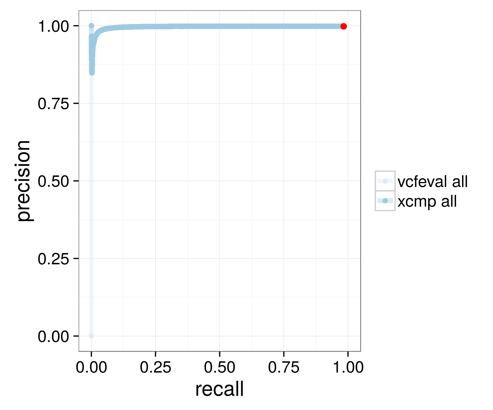
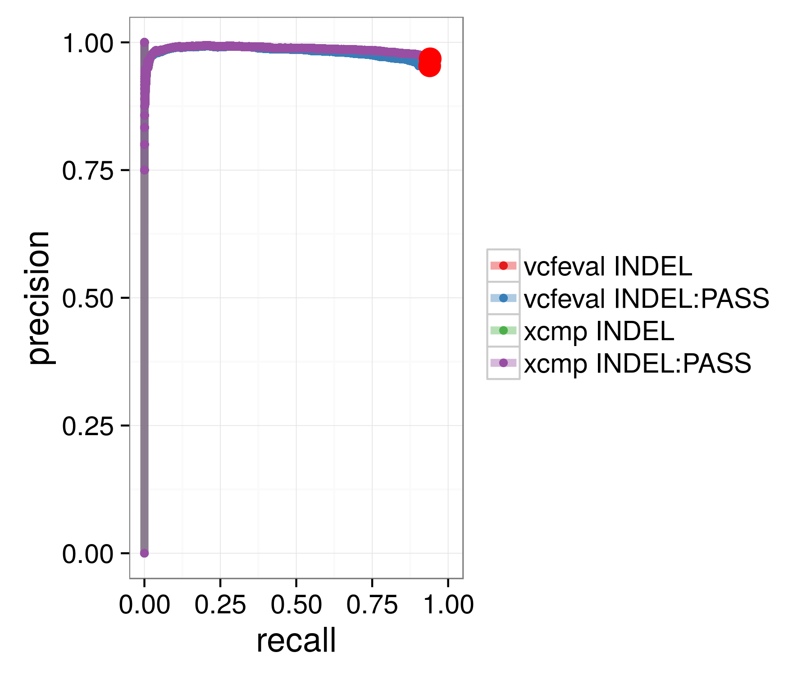
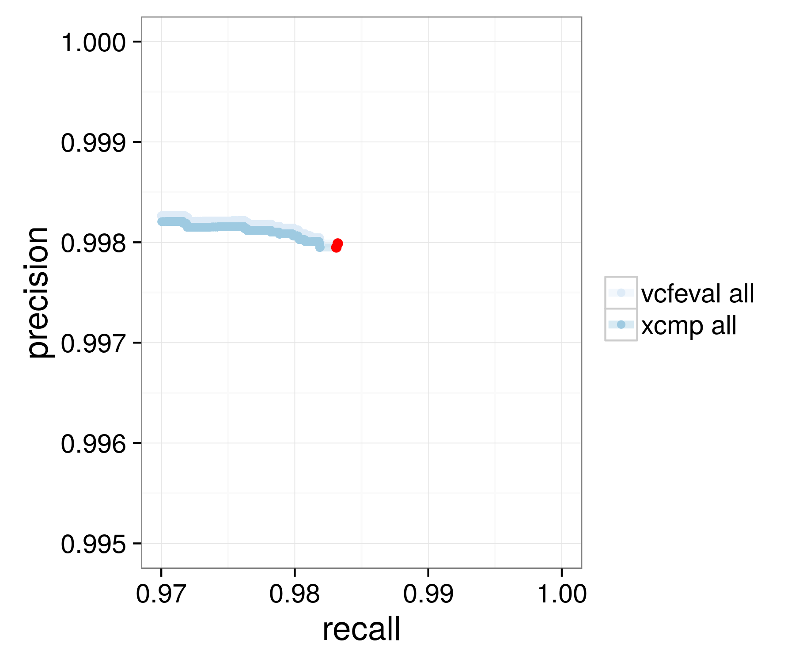
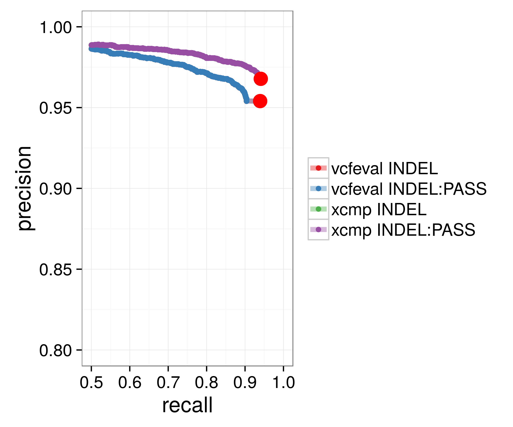
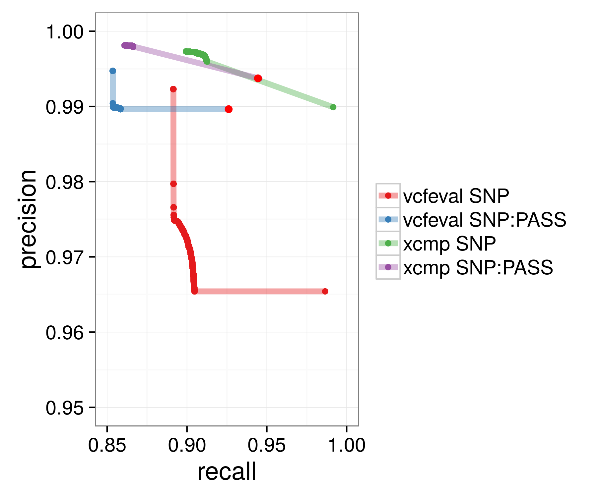
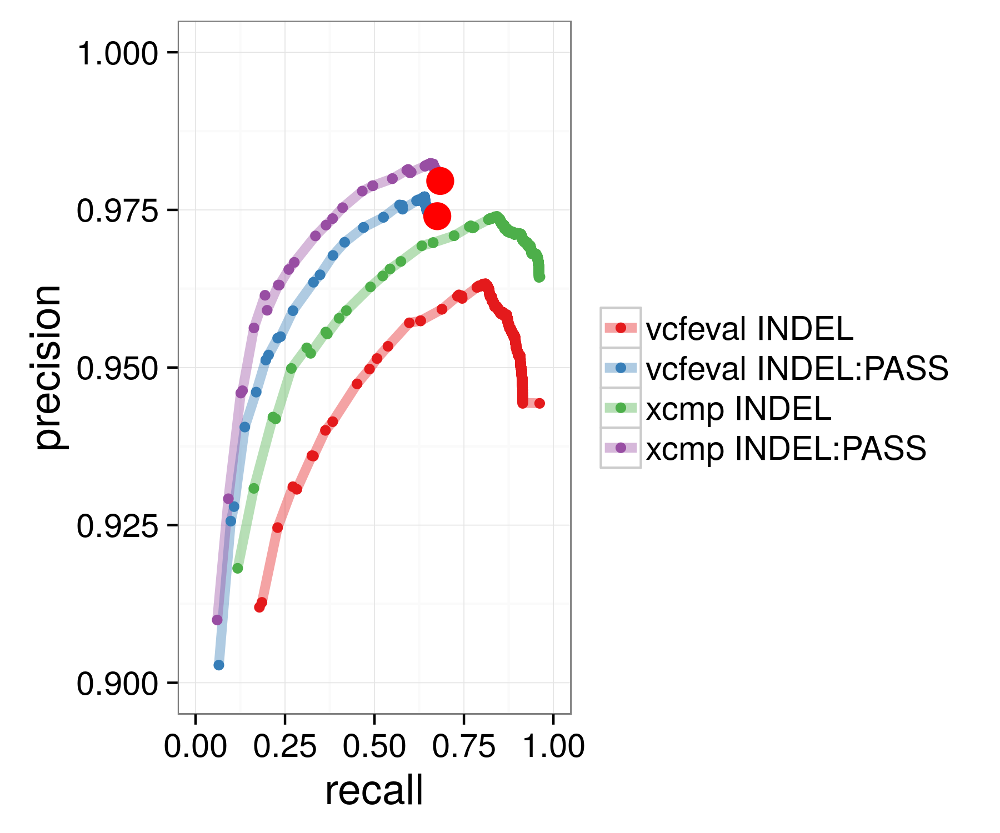

Hap.py User's Manual
====================

Introduction
------------

Hap.py is a tool to compare diploid genotypes at haplotype level. Rather than
comparing VCF records row by row, hap.py will generate and match alternate
sequences in *haplotype blocks*. A haplotype block is a small region of the
genome (sized between 1 and around 1000 bp) that contains one or more variants.

Matching haplotype sequences rather than VCF records is more accurate. It allows
 us to the following things:

*  We can match up variant records that represent the same alt sequences in a
   different form (see [example/GiaB](example/GiaB)).
*  We can also more accurately merge variant call sets
   (see [ls_example.md](ls_example.md)).

The inputs to hap.py are two VCF files (a "truth" and a "query" file), and an
optional "confident call region" bed file (NOTE: bed files with
[track information](https://genome.ucsc.edu/goldenPath/help/customTrack.html)
are not supported, all input bed or bed.gz files must only contain bed records).

Hap.py will report counts of

*   ***true-positives (TP)***: variants/genotypes that match in truth and query.
*   ***false-positives (FP)***: variants that have mismatching genotypes or alt
    alleles, as well as query variant calls in regions a truth set would call
    confident hom-ref regions.
*   ***false-negatives (FN)*** : variants present in the truth set, but missed
    in the query.
*   ***non-assessed calls (UNK)***: variants outside the truth set regions

From these counts, we are able to calculate

```
recall = TP/(TP+FN)
precision = TP/(TP+FP)
frac_NA = UNK/total(query)
```

These counts and statistics will be calculated for the following subsets of
variants:

```
|---------------------+-------------------------------------------------------|
|         Type        |                      Description                      |
|---------------------+-------------------------------------------------------|
| Alleles.SNP/INS/DEL | Allele counts. We count occurrences of SNP, insertion |
|                     | or deletion alleles. For hom-alt SNPs, each allele is |
|                     | counted exactly once (so the counts aren't biased     |
|                     | towards hom-alt calls). The idea between these counts |
|                     | is that each counted instance belongs to a particular |
|                     | group of reads / haplotype.                           |
|---------------------+-------------------------------------------------------|
| Locations.SNP/INDEL | Location counts are useful to compute recall for het, |
|                     | hom, or het-alt calls separately, and to quantify     |
|                     | genotyping accuracy. Note that hap.py performs        |
|                     | variant normalisation by default (see                 |
|                     | [normalisation.md](normalisation.md)), which will     |
|                     | change the input records in truth and query.          |
|---------------------+-------------------------------------------------------|
```


Simple Usage
------------

Below, we assume that the code has been installed to the directory `${HAPPY}`.

```bash
$ ${HAPPY}/bin/hap.py  \
      example/happy/PG_NA12878_chr21.vcf.gz \
      example/happy/NA12878_chr21.vcf.gz \
      -f example/happy/PG_Conf_chr21.bed.gz \
      -o test
$ ls test.*
test.metrics.json  test.summary.csv test.extended.csv
```

This example compares an example run of GATK 1.6 on NA12878 agains the Platinum
Genomes reference dataset (***Note: this is a fairly old version of GATK, so
don't rely on these particular numbers for competitive comparisons!***).

The summary CSV file contains all computed metrics:

|         Type         | TRUTH.TOTAL | QUERY.TOTAL | METRIC.Recall.HC | METRIC.Precision.HC | METRIC.Frac_NA.HC |
|----------------------|-------------|-------------|------------------|---------------------|-------------------|
| Alleles.DEL          |        6069 |        7020 |         0.907460 |            0.973996 |          0.205698 |
| Alleles.INS          |        6654 |        7179 |         0.880879 |            0.975355 |          0.186098 |
| Alleles.SNP          |       72752 |       67481 |         0.904442 |            0.998361 |          0.023547 |
| Locations.SNP.het    |       32254 |       28665 |         0.873368 |            0.997875 |          0.015175 |
| Locations.SNP.homalt |       20231 |       19270 |         0.929317 |            0.999097 |          0.023560 |


False-positives
---------------

When comparing two VCFs, genotype and allele mismatches are counted both as
false-positives and as false-negatives. Truth sets like Platinum Genomes or
NIST/Genome in a Bottle also include "confident call regions", which show places
where the truth dataset does not expect variant calls.
Hap.py can use these regions to count query variant calls that do not match
truth calls and which fall into  these regions as false positives.

Full List of Command line Options
---------------------------------

### Minimal Options

You can run hap.py with the -h switch to get help.

The first two positional arguments are used as the input VCF files. The output
file prefix is specified using `-o` (this should be something in the form
of directory/prefix):

```
$ ${HAPPY}/bin/hap.py truth.vcf.gz query.vcf.gz \
      -o output-prefix --force-interactive
```

### Running / Debugging issues

```
  --force-interactive
```

Force running interactively (i.e. when JOB_ID is not in the environment)
This is only available if Hap.py is set up to run inside SGE.
Unless forced, it will not run interactively
(it detects this by looking for the environment variable SGE_JOB_ID).

The reason for this is that parallelism is implemented using the multiprocessing
module in Python, which spawns processes that can take a lot of memory and also
may be difficult to kill interactively.

*This feature must be enabled when installing / compiling hap.py.* See the
installation instructions in [../README.md](../README.md).

```
  --threads THREADS
```

The number of threads to use. This is detected automatically by default using
Python's multiprocessing module (we recommend around 1GB of RAM per thread).

```
  --logfile LOGFILE
```

Write logging information into file rather than to stderr.

```
  --scratch-prefix SCRATCH_PREFIX
  --keep-scratch
```

All temporary files go into a scratch folder, which normally defaults to a
subdirectory of `/tmp`. This can be customised (e.g. when fast local storage is
available).

### Restricting to Subsets of the Genome / Input

```
  --location LOCATIONS, -l LOCATIONS
```

Add a location to the compare list (when not given, hap.py will use chr1-22,
chrX, chrY).

```
  -P, --include-nonpass
```

Use to include failing variants in comparison. Failing variants are actually
considered _optional_ rather than mandatory during haplotype comparison (
therefore, )

```
  -R REGIONS_BEDFILE, --restrict-regions REGIONS_BEDFILE
```

Restrict analysis to given (sparse) regions (similar to using -R in bcftools).
Sparse regions should be used when there are not many regions to look at
(the corresponding calls are retrieved via tabix lookup, so this will be
slow for many regions). Also, the regions must not overlap (otherwise, hap.py
will fail).

```
  -T TARGETS_BEDFILE, --target-regions TARGETS_BEDFILE
```

Restrict analysis to given (dense) regions (similar to using -T in bcftools).
One example use for this is to restrict the analysis to exome-only data.

### Additional Input Options

```
  -f FP_BEDFILE, --false-positives FP_BEDFILE
```

False positive / confident call regions (.bed or .bed.gz).

```
  -r REF, --reference REF
```

Specify the reference FASTA file to use. Hap.py detects a default reference
sequence file at the following locations:

*  at `/opt/hap.py-data/hg19.fa` (see the Dockerfile)
*  at the location of the HGREF or the HG19 environment variable

To specify a default reference file location, you can run

```bash
export HGREF=path-to-your-reference.fa
```

before running hap.py.

### Additional Outputs

```
  -V, --write-vcf
```

Write an annotated VCF. This file follows the GA4GH specifications at
[https://github.com/ga4gh/benchmarking-tools/blob/master/doc/ref-impl/README.md](https://github.com/ga4gh/benchmarking-tools/blob/master/doc/ref-impl/README.md)

It shows the merged and normalised truth
and query calls, together with annotation that shows how they were counted.
There are two sample columns ("TRUTH" and "QUERY"), showing the genotypes
for each variant in truth and query, along with information on the decision
for truth and query calls (TP/FP/FN/N/UNK). See the [GA4GH page above](https://github.com/ga4gh/benchmarking-tools/blob/master/doc/ref-impl/README.md)
for more details.

### Internal Variant Normalisation and Haplotype Comparison

```
  --partial-credit      give credit for partially matched variants. this is
                        equivalent to --internal-leftshift and --internal-
                        preprocessing.
  --no-partial-credit   Give credit for partially matched variants. This is
                        equivalent to --no-internal-leftshift and --no-
                        internal-preprocessing.
  --internal-leftshift  Switch off xcmp's internal VCF leftshift
                        preprocessing.
  --internal-preprocessing
                        Switch off xcmp's internal VCF leftshift
                        preprocessing.
  --no-internal-leftshift
                        Switch off xcmp's internal VCF leftshift
                        preprocessing.
  --no-internal-preprocessing
                        Switch off xcmp's internal VCF leftshift
                        preprocessing.
  --no-haplotype-comparison
                        Disable haplotype comparison (only count direct GT matches as TP).
  --unhappy
                        Disable all clever matching (equivalent to --no-internal-leftshift
                        --no-internal-preprocessing --no-haplotype-comparison).
```

These switches control xcmp's internal VCF [leftshifting preprocessing](normalisation.md).
The partial credit switch jointly enables / disables preprocessing and left shifting. The
next section gives some more details on the effect that these comparison modes can have.

### ROC Curves

Hap.py can create data for ROC-style curves. Normally, it is preferable to calculate
such curves based on the input variant representations, and not to perform any
variant splitting or preprocessing.

Here are the options which need to be added to a hap.py command line to create
a ROC curve based on the query GQX field (currently, hap.py will only use GQ
if GQX is not available):

```
  ...
  --no-internal-leftshift \
  --no-internal-preprocessing \
  -P -V \
  --roc Q_GQ \
  ...
```

The `-P` switch is necessary to consider unfiltered variants, `-V` will write an
annotated output VCF which is used to extract the features and labels. The `--roc` switch
specifies the feature to filter on. Hap.py translates the truth and query GQ(X) fields into
the INFO fields T_GQ and Q_GQ, it tries to use GQX first, if this is not present, it
will use GQ. When run without internal preprocessing any other input INFO field can
be used (e.g. VQSLOD for GATK).

The `--roc-filter` switch may be used to specify the particular VCF filter which
implements a threshold on the quality score. When calculating filtered TP/FP counts, this
filter will be removed, and replaced with a threshold filter on the feature specified
by `--roc`. By default, the ROC will be calculated ignoring all filters.

Normally, we assume that higher quality scores are better during ROC calculation,
variants with scores higher than the variable threshold will "pass", all others will
"fail".

The output file will be comma-separated value files giving tp / fp / fn counts,
as well as precision and recall for different thresholds of the ROC feature.
Here is a full example (assuming the folder hap.py contains a clone of the
hap.py repository, and that hap.py can be run through PATH):

```
hap.py hap.py/example/happy/PG_NA12878_hg38-chr21.vcf.gz \
       hap.py/example/happy/NA12878-GATK3-chr21.vcf.gz \
       -f hap.py/example/happy/PG_Conf_hg38-chr21.bed.gz \
       -r hap.py/example/happy/hg38.chr21.fa \
       -o gatk-all -P -V \
       --roc QUAL
```

After running, this will produce a set of outputs as follows.

```
ls gatk-all.*
gatk-all.counts.csv
gatk-all.extended.csv
gatk-all.summary.csv
gatk-all.roc.Locations.SNP.csv
gatk-all.roc.Locations.SNP_PASS.csv
gatk-all.roc.Locations.INDEL.csv
gatk-all.roc.Locations.INDEL_PASS.csv
gatk-all.vcf.gz
gatk-all.vcf.gz.tbi
gatk-all.metrics.json
```

The SNP ROC file starts like this:

```
type	QUAL	FN	TP	FN2	TP2	FP	UNK	N	recall	precision	f1_score	na	total.truth	total.query
SNP	0	857	50159	0	50097	101	20260	0	0.983201	0.997988	0.49527	0.287547	51016	70458
SNP	25.33	923	50093	0	50097	101	20259	1	0.981908	0.997988	0.494941	0.287537	51016	70457
SNP	26.45	923	50093	0	50097	101	20250	10	0.981908	0.997988	0.494941	0.287446	51016	70448
SNP	27.77	923	50093	0	50097	101	20242	18	0.981908	0.997988	0.494941	0.287365	51016	70440
SNP	28.83	923	50093	0	50097	101	20233	27	0.981908	0.997988	0.494941	0.287274	51016	70431
SNP	29.91	924	50092	1	50096	101	20228	32	0.981888	0.997988	0.494936	0.287228	51016	70425
...
```

Hap.py can produce ROCs using vcfeval (see below for instructions)
or xcmp (hap.py's internal comparison engine).

There are a few differences between these comparison modes which are reflected
in the ROC outputs.

| Comparison mode              | Leftshifting of Indels | Splitting of Variants | FP/FN/TP Granularity               | Comment                                                         |
|:-----------------------------|:----------------------:|:---------------------:|:-----------------------------------|-----------------------------------------------------------------|
| hap.py default               |           Yes          |          Yes          | Superlocus haplotype / exact match | Most granular counting                                          |
| hap.py `--no-partial-credit` |           No           |           No          | Superlocus haplotype / exact match | Similar to vcfeval but slightly lower precision / recall        |
| hap.py `--unhappy`           |           No           |           No          | exact match only                   | Naive matching                                                  |
| hap.py `--engine vcfeval`    |           No           |           No          | haplotype match per VCF record     | Preserves original variant representation, no granular counting |


We can plot the following ROCs from the *.roc.*.csv files. The plots below also
show that the results when using xcmp or vcfeval as the comparison engine in
hap.py are mostly equivalent for SNPs. For indels, xcmp shows higher precision
for two reasons:

* partial credit matching allows a more fine-grained assessment of precision.
* when indels have different representations, vcfeval outputs these as separate
  records, whereas xcmp normalizes them to be in the same VCF row if possible.
  *NOTE: this is work in progress and based on a development version of vcfeval**
* When it is necessary to preserve the original variant representation, vcfeval
  generally matches slightly more records than hap.py when the `--no-partial-credit`
  is supplied. The reasons for this is that hap.py matches only on a superlocus
  granularity, whereas vcfeval can assess TP/FP/FN status for each variant also
  within superloci (blocks of close-by variants). In practice, this results in
  slightly higher precision estimates when using hap.py with vcfeval vs hap.py
  without partial credit.

|        | *SNP*                      | *INDEL*                      |
|:------:|:--------------------------:|:----------------------------:|
| Full   |  |  |
| Zoomed |       |       |


When using Platypus, the ROC behaviour is more complex.

```
hap.py hap.py/example/happy/PG_NA12878_hg38-chr21.vcf.gz \
       hap.py/example/happy/NA12878-Platypus-chr21.vcf.gz \
       -f hap.py/example/happy/PG_Conf_hg38-chr21.bed.gz \
       -r hap.py/example/happy/hg38.chr21.fa \
       -o platypus-all -P -V \
       --roc QUAL
```

* Platypus outputs more complex alleles which need to be compared with partial credit
  to get a more accurate picture of the comparative precision.
* Platypus has a larger set of filters which are independent of the QUAL score.
  This means that the ROC for PASS calls (which only considers calls that pass all filters)
  will have significantly higher precision and lower recall.
* Platypus prefers to output SNPs in phased blocks, which is very different from the
  truthset representation of the variants. Splitting these using partial credit gives
  more resolution when drawing ROCs. Vcfeval's internal ROC code handles this by
  weighting, which is similar to our partial credit counting; in hap.py we have chosen
  to implement variant decomposition instead of weights to be able stratify the ROCs
  more transparently into SNPs and INDELs.

|           *SNP*           |           *INDEL*           |
|:-------------------------:|:---------------------------:|
|  |  |


### Input Preprocessing

Hap.py has a range of options to control pre-processing separately for truth
and query. Most of these require the `--external-preprocessing`  switch to work.

#### BCFtools norm

Truth and query can be preprocessed using `bcftools norm -c x -D` as follows:

```
  --preprocess-truth    Preprocess truth file using bcftools.
  --bcftools-norm       Preprocess query file using bcftools.
```

### Chromosome naming

Normally, the reference fasta file, truth and query should have matching
chromosome names. However, since e.g. Platinum Genomes doesn't have a specific
GRCH37 version with numeric chromosome names (names like `1` rather than
`chr1`), this can be worked around in pre-processing (assuming the sequences
are otherwise identical).

```
  --fixchr-truth        Add chr prefix to truth file (default: auto).
  --fixchr-query        Add chr prefix to query file (default: auto).
  --no-fixchr-truth     Disable chr replacement for truth (default: auto).
  --no-fixchr-query     Add chr prefix to query file (default: auto).
  --no-auto-index       Disable automatic index creation for input files. The
                        index is only necessary at this stage if we want to
                        auto-detect locations. When used with -l, and when it
                        is known that there are variants at all given
                        locations this is not needed and can be switched off
                        to save time.
```

Normally this is detected automatically from the VCF headers / tabix indexes /
the reference FASTA file. The reason for having this set of options is that
Platinum Genomes truth VCFs for hg19 (which have chr1 ... chr22 chromosome names)
can be used also on grc37 query VCFs(which have numeric chromosome names) because
PG only provides truth calls on chr1-chr22, chrX (which have identical sequence
in these two references, only chromosome names are different).

Generally, *the truth files (BED and VCF) should have consistent chromosome names
with the reference that is used*, and hap.py can be used to add on a chr prefix
to the query VCF if necessary.

### Haplotype Comparison Parameters

```
  -w WINDOW, --window-size WINDOW
```

Window size for haplotype block finder. We use a sliding window, this parameter
determines the maximum distance between two variants that ensures that they
end up in the same haplotype block. For larger values, the haplotype blocks
get larger and might capture more het variants that will cause the enumeration
threshold (below) to be reached. Also, longer haplotype blocks take more time
to compare. The default value here is 30.

```
  --enumeration-threshold MAX_ENUM
```

Enumeration threshold / maximum number of sequences to enumerate per block.
Basically, each unphased heterozygous variant in a block doubles the number
of possible alternate sequences that could be created from the set of variants
within a haplotype block (10 hets in a row would result in 1024 different
alternate sequences).

```
  -e HB_EXPAND, --expand-hapblocks HB_EXPAND
```

Reference-pad and expand the sequences generate haplotype blocks by this many
basepairs left and right.  This is useful for approximate block matching.

### Using RTG-Tools / VCFEval as the comparison engine

RTG-Tools (see [https://github.com/RealTimeGenomics/rtg-tools](https://github.com/RealTimeGenomics/rtg-tools)
provides a feature called "vcfeval" which performs complex variant comparisons. Hap.py
can use this tool as a comparison engine instead of its built-in `xcmp` tool.

This feature requires a version of rtg-tools which supports the GA4GH benchmarking intermediate
file formats (see [https://github.com/ga4gh/benchmarking-tools](https://github.com/ga4gh/benchmarking-tools)).
Currently, such a version is available in this branch:
[https://github.com/realtimegenomics/rtg-tools/tree/ga4gh-test](https://github.com/realtimegenomics/rtg-tools/tree/ga4gh-test)

Before using RTG tools, it is necessary to translate the reference Fasta file into
the SDF format (this only needs to be done once for each reference sequence):

```
rtg format -o hg19.sdf hg19.fa
```

This creates a folder `hg19.sdf`, which must be passed to hap.py using the `--engine-vcfeval-template hg19.sdf`
arguments.

The hap.py command line arguments for using vcfeval are as follows (assuming that RTG tools is installed
in `~/rtg-install`, and that the folder `hg19.sdf` created by the previous command line is in the current
directory):

```
hap.py truth.vcf.gz query.vcf.gz -f conf.bed.gz -o ./test -V --engine=vcfeval --engine-vcfeval-path ~/rtg-install/rtg --engine-vcfeval-template hg19
```

Most other command line arguments and outputs will work as before.
