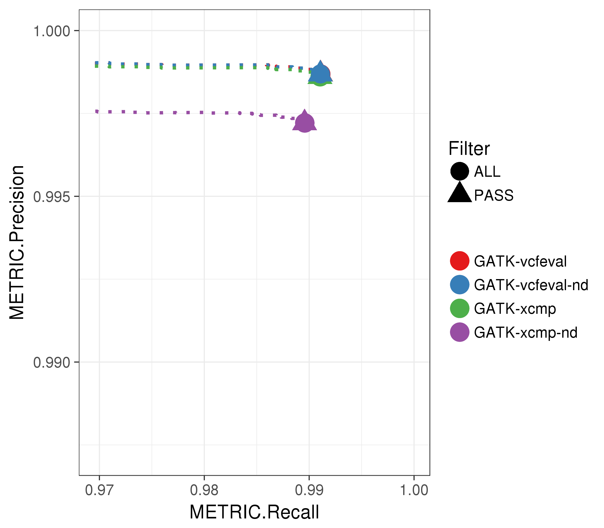
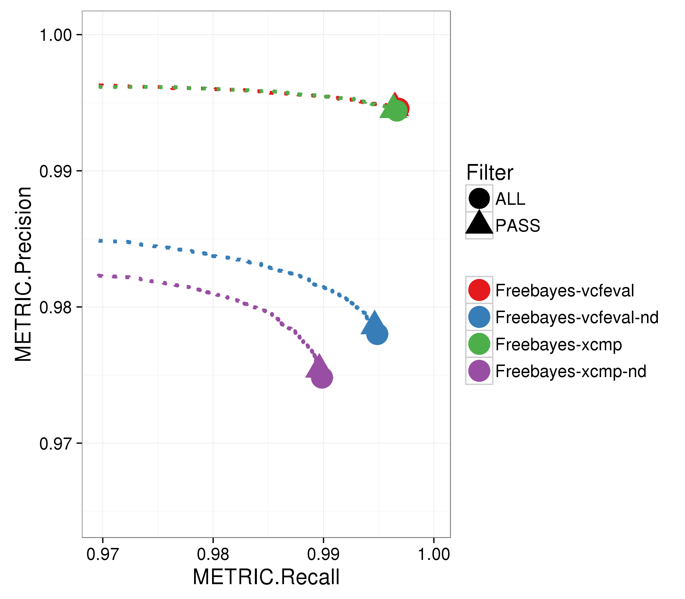
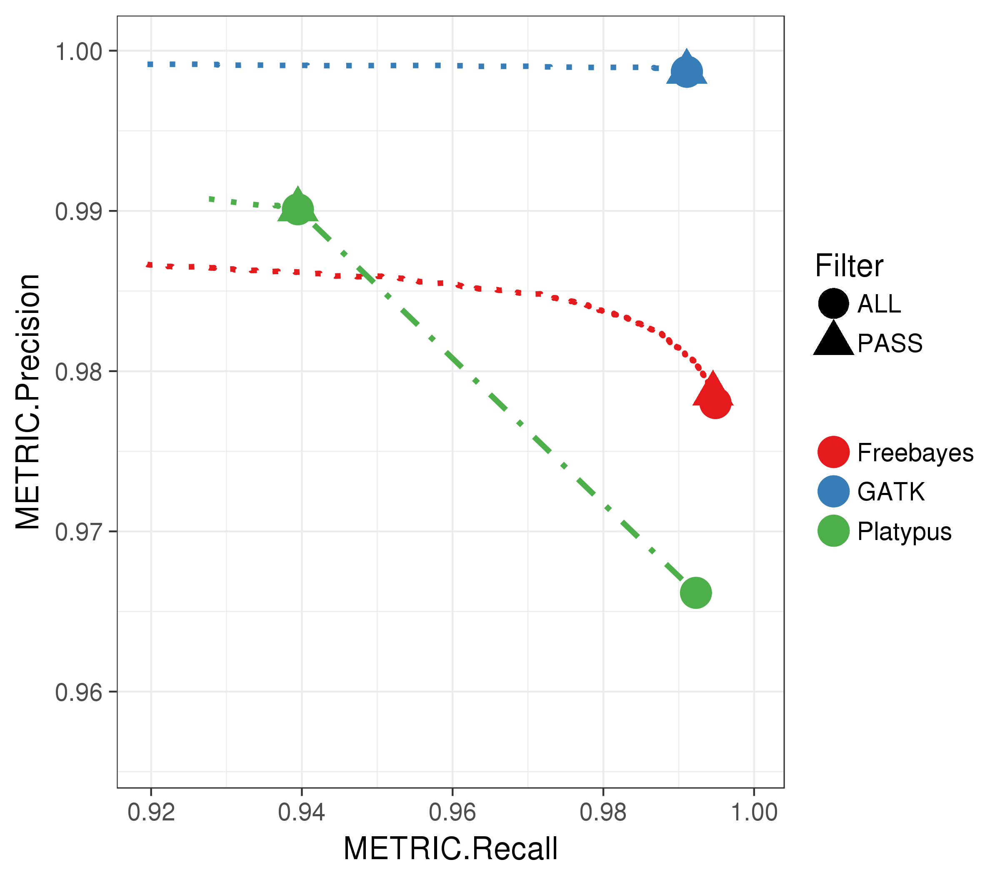
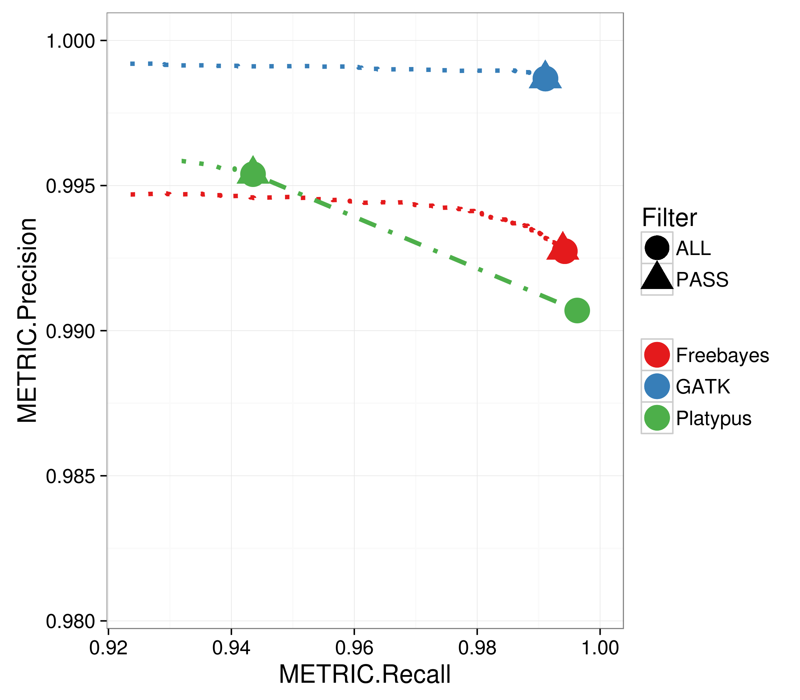

# Micro-benchmark

To test hap.py and show how ROC curves work, we have a small set of test
datasets in this repository. These are contained in the [example/happy]()
folder.

The folder contains partial callsets for Platinum Genomes 2016.1 and for
GATK3, Platypus and Freebayes on NA12878. All three methods were run using
their joint-calling mode across the whole PG pedigree. We benchmark
their precision and recall against the PG callset using different methods
and produce ROCs. [example/happy/microbenchmark.sh]() contains a script to
run hap.py in different configurations on these datasets. It needs to be
run either from a hap.py build folder, or pointed to a hap.py installation
using the `HCDIR` environment variable.

The script will produce benchmarking datasets for the following configurations:

{ GATK, Platypus, Freebayes } x { xcmp, vcfeval } x { decompose, no-decompose }

Xcmp and vcfeval are two different comparison engines, and decompose /
no-decompose are two options for pre-processing. Decomposing query variants
into primitives allows for more granular counting of TPs and FPs. However,
this pre-processing step also removes phasing information that might have
been implicit in the blocked variants (when using decomposition, phased SNPs
 / MNPs are allowed to match regardless of phase.

A first observation is that the methods all produce fairly similar results on GATK,
but as different callers introduce different variant representations, differences
start to appear. Hap.py's default comparison engine "xcmp" was developed using
decomposed variant representations and struggles when variants are not decomposed
into primitives.

| SNPs                         | Indels                       |
|------------------------------|------------------------------|
|  |  |
|  |  |
|  |  |

We can also compare our three methods with and without variant decomposition.

| | SNPs                         | Indels                       |
|-----|------------------------------|------------------------------|
| No decomposition |  |  |
| With decomposition |  |  |

Any set of hap.py runs can be plotted like this using the script
[src/R/rocplot.Rscript]().
