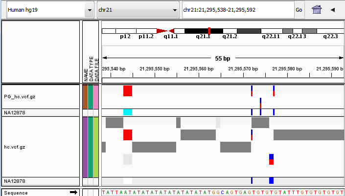
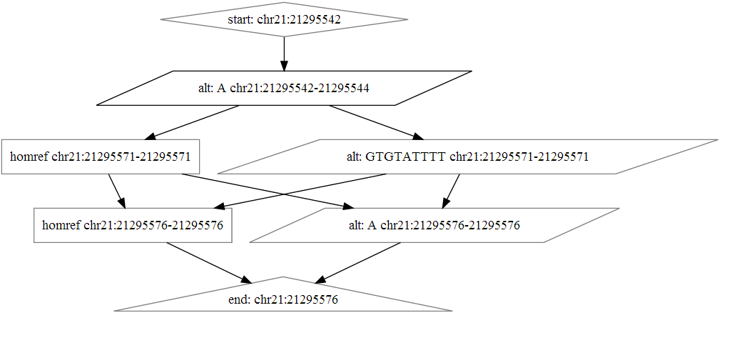

Reference Graphs
================

Reference graphs are used to represent alternative haplotypes (there is
ambiguity in case of unknown phasing).

A reference graph gives alternative sequences on a fixed chromosome.

Node Data
---------

Each node stores information on

* its start and end on the chromosome (reference coordinates)
* a list of reference modifications (alternative sequences)
* a type (see below)
* optionally, a color (for phasing)

Node Types
----------

*  **Unknown**: no variance information is known (when getting sequence for
   this, we will assume that the sequence is equal to the reference, but we may
   treat these regions differently in comparison / reporting results).
*  **Homref**: the sequence is equal to the genome reference
*  **Alt**: There is an alternative sequence which is different from the
   reference in this region.

Node Colors
-----------

Node colors are used to restrict the paths we traverse in the graph for phased
comparisons.

*  Red: Node is likely phased to maternal (left in VCF) haplotype
*  Blue: Node is likely phased to paternal (right in VCF) haplotype
*  Black: Node is present on all haplotypes.
*  Grey: Phasing of node is unknown, but it is not present on all of them
   (unphased het).

Edges
-----

We allow edges between nodes $n_1$ and $n_2$ if $start(n_2) > end(n_1)$. Edges
may carry additional information derived from the variant records (e.g. variant
quality / GQX), or e.g. from BAM files / read alignments / assemblies.

Example
-------

The track for `hc.vcf.gz` in this screenshot:



... generates this graph



Debugging Reference Graphs
--------------------------

This package includes the `hapenum` tool, which can generate dot files for
VCF regions (input must be gzipped+tabixed):

```bash
${hap.py}/bin/hapenum -r reference.fasta input.vcf.gz \
    --output-dot graph.dot -l chr1:1-1000 && dot -Tsvg graph.dot > graph.svg
```

Another test to perform on regions of interest in a VCF is to check which haplotype
pairs (assuming a diploid genome, we must find two non-exclusive paths in the graph
that correspond to two haplotypes) can be generated. The `dipenum` tool will show
all haplotype sequence pairs that can be created from a particular VCF locus:

```bash
${hap.py}/bin/dipenum -r reference.fasta input.vcf.gz \
    -l chr1:1-1000
```

Finally, hap.py comes with a VCF validation tool that will check REF alleles and
test if a sensible set of haplotypes can be enumerated for individual VCF loci.

```bash
$ bin/validatevcf -r hg19.fa dtest.vcf.gz
[W] REF allele mismatch with reference sequence at chr1:237636278-237636309 VCF: TTTTTTCCACCTTGCTTTTACTTTTTTTTTTA REF: TTTTTCCACCTTGCTTTTACTTTTTTTTTTAA
[W] Found a variant with more 3 > 2 (max) alt alleles. These become no-calls.
```

This tool can also output (using the `-o` command line option) an annotated VCF
file which will give error annotations for each variant call. By default, `validatevcf`
will write variants in their input representation. Using the `-V 1 -W 1 -L 1` command
line options will have `vcfvalidate` output variants in the same representation that
hap.py uses internally for "partial credit" comparisons (i.e it will perform left-shifting
and allele realignment).

